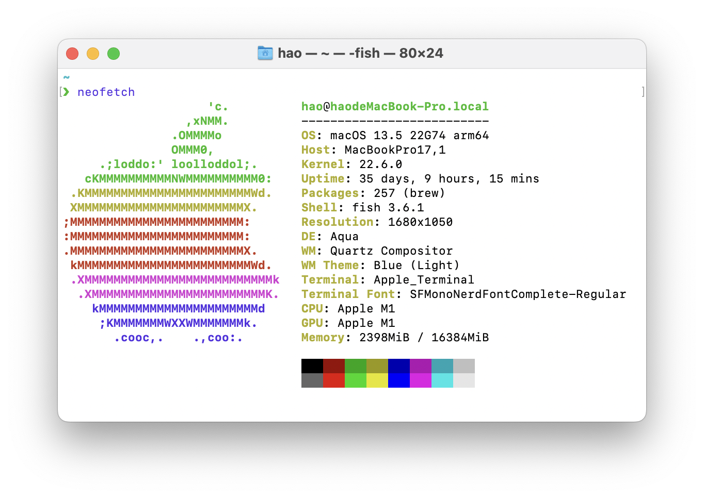
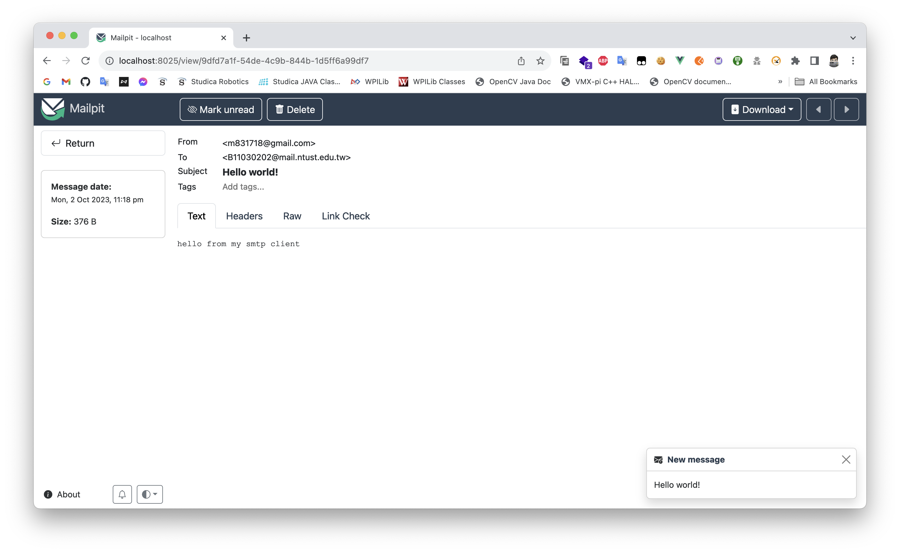

# HW01-01 SMTP Client

Written in go.


## Dependency

- Go >= 1.18


 ## Build

```bash
go build
```


## Run

### Usage

```shell
./assignment01 -h
Usage of ./assignment01:
  -body string
        email content
  -from string
        sender email address
  -host string
        smtp server address
  -title string
        email title
  -to string
        receiver email address
```

### Example

```bash
./assignment01 -host localhost:1025 -from m831718@gmail.com -to B11030202@mail.ntust.edu.tw -title "Hello world!" -body "hello from my smtp client"

successful
```


## Test Result

### Test Platform



#### macOS

```
Darwin haodeMacBook-Pro.local 22.6.0 Darwin Kernel Version 22.6.0: Wed Jul  5 22:22:52 PDT 2023; root:xnu-8796.141.3~6/RELEASE_ARM64_T8103 arm64
```

#### Go

```
go version go1.21.1 darwin/arm64
```

#### Mailpit (SMTP Server)

```
Mailpit (1.9.4)
```


### Test Case

#### Command

```bash
./assignment01 -host localhost:1025 -from m831718@gmail.com -to B11030202@mail.ntust.edu.tw -title "Hello world!" -body "hello from my smtp client"

successful
```

#### Result

