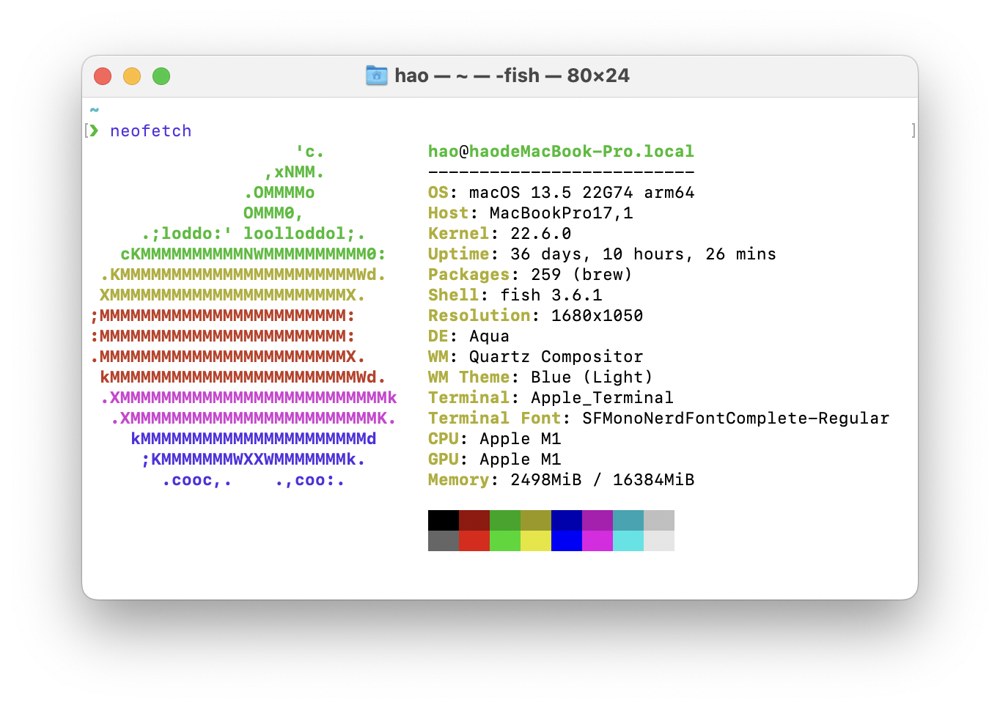
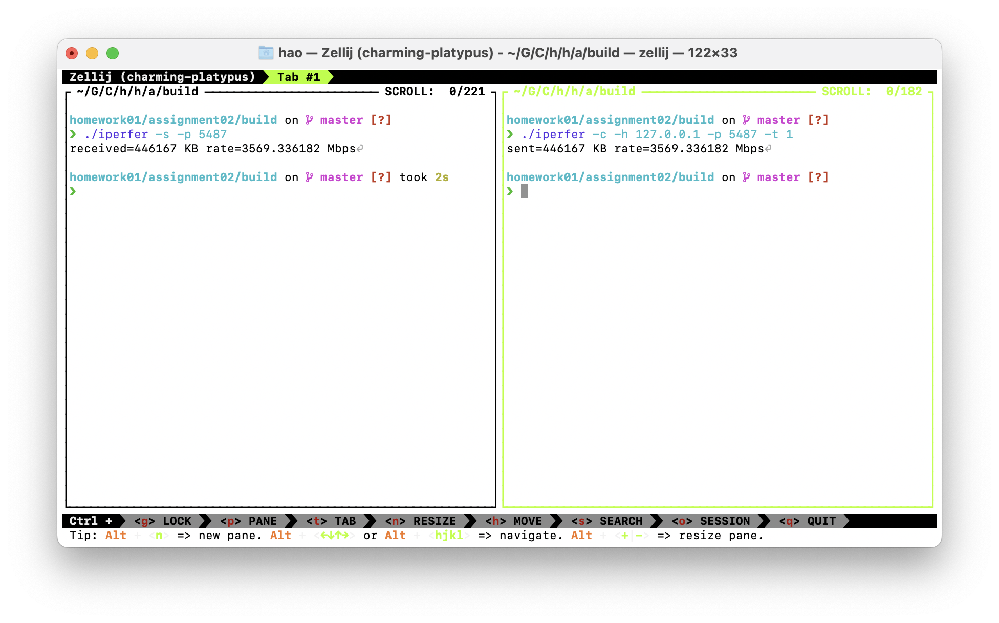

# HW01-02 Iperfer

Written in go.


## Dependency

- Go >= 1.18


## Build

```bash
go build
```


## Run

### Usage

```shell
./iperfer -h
flag needs an argument: -h
Usage of ./iperfer:
  -c    client mode
  -h string
        host address to connect
  -p uint
        port to connect or listen on
  -s    server mode
  -t int
        duration in seconds for which data should be generated
```

### Example

#### Run as Server

```bash
./iperfer -s -p 5487
```

#### Run as Client

```bash
./iperfer -c -h 127.0.0.1 -p 5487 -t 1
```


## Test Result

### Test Platform



#### macOS

```
Darwin haodeMacBook-Pro.local 22.6.0 Darwin Kernel Version 22.6.0: Wed Jul  5 22:22:52 PDT 2023; root:xnu-8796.141.3~6/RELEASE_ARM64_T8103 arm64
```

#### Go

```
go version go1.21.1 darwin/arm64
```

### Test Case


